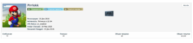

**The actor's nickname Pirrlokk was provided for verification, as well as a link to his profile:  `https://bhf.io/members/158106`**

![[1.png|700]]

>[!info]
>Based on the data obtained as a result of the check, we can conclude that the beginning of the shadow activity of actor Pirrlokk falls at the end of 2016 and continues to the current moment.
>It should be noted forums bhf[.]io, wwh-club[.]]io, lolz[.]guru were used more actively.
>During the analysis of actor activity, it was found that the main direction is mainly the purchase (digital goods) - digital keys for games, programs, as well as gift cards for various marketplaces, presumably for further resale. 
>A detailed analysis established the activity of actor Pirrlokk in the sale of cryptocurrency, the relationship to the project `http://lightpaycoin.org`,`https://source-byte.com` as well as other legitimate activities.

- Инструменты:
  - Maltego
  - Spiderfoot
  - Custom scripts
- Данные:
  - Утечки
  - ASN/подсети

![[/images/2.png|700]]
*Рисунок 1. Архитектура кейса*

> «В этом расследовании злоумышленники использовали Discord как C2.»

| Задача                   | Ссылка                                  |
| ------------------------ | --------------------------------------- |
| Соц. граф                |  |
| Автоматизированный OSINT |  |
| Поиск по утечкам         |  |
